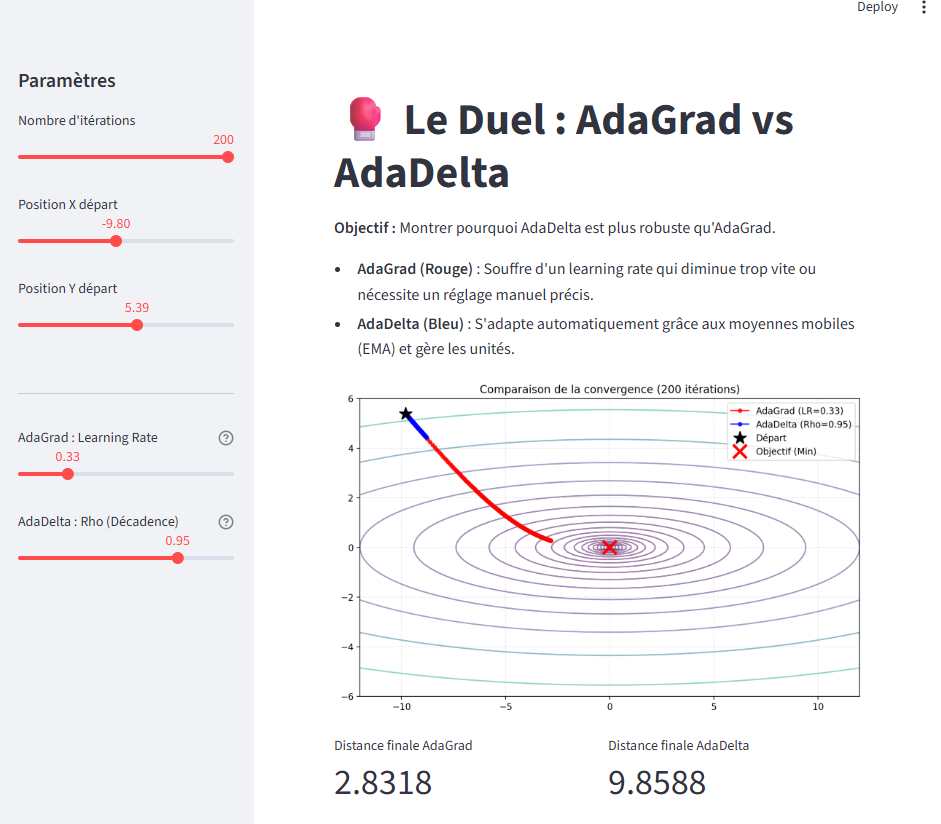

# 🥊 AdaGrad vs. AdaDelta: Optimization Battle

[](https://www.python.org/)
[](https://streamlit.io/)

Interactive visualization comparing AdaGrad and AdaDelta optimizers on a 2D loss surface.



## Why This Exists

AdaGrad adapts learning rates but the accumulator grows forever, causing steps to shrink to zero. AdaDelta fixes this with exponential moving averages. I wanted to see the difference visually.

## What It Does

- Implements both optimizers from scratch in NumPy (no PyTorch/TensorFlow)
- Shows convergence paths on a contour plot ($f(x,y) = x^2 + 20y^2$)
- Lets you adjust learning rates, decay, starting points, iterations
- Compares final distances to the minimum

## Run It
```bash
git clone https://github.com/monsif1999/adagrad-vs-adadelta.git
cd adagrad-vs-adadelta
pip install numpy matplotlib streamlit
streamlit run app.py
```

## The Math

**AdaGrad:**
$$\theta_{t+1} = \theta_t - \frac{\eta}{\sqrt{G_t + \epsilon}} \cdot g_t$$

Problem: $G_t$ keeps growing, so updates die out.

**AdaDelta:**
$$\Delta \theta_t = - \frac{\text{RMS}[\Delta \theta]_{t-1}}{\text{RMS}[g]_t} \cdot g_t$$

Fix: Uses moving averages instead of infinite accumulation. No manual learning rate needed.

## What I Learned

- Why adaptive learning rates matter on weird loss surfaces
- AdaGrad works until it doesn't (watch the learning rate collapse)
- AdaDelta's RMS trick actually works in practice